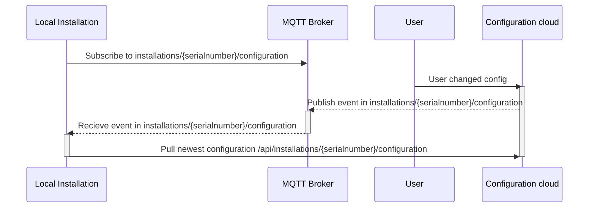

#Installation
Run the following command to install the package:
```
pip3 install -r requirements.txt
```

#Usage
Fill username and password in main.py.

Run the following command to run the program:
```
python3 main.py
```



# Interface
Die lokale Installation muss sich mit ``username`` und ``password`` bei einem MQTT Broker anmelden. Danach hört es auf das Topic ``installations/{serialnumber}/configuration`` dabei werden alle Nachrichten mit dem Payload ``{ "event": "newConfiguration" }`` empfangen. 

Wenn eine Nachricht empfangen wird, wird die Konfiguration vom CEM-Cloud Backend abgerufen. Über die REST API ``/api/installations/{serialnumber}/configuration?token=<token>`` wird die Konfiguration abgerufen.
Username, Password und Token werden beim Aufsetzten der lokalen Installation zur Verfügung gestellt. 
